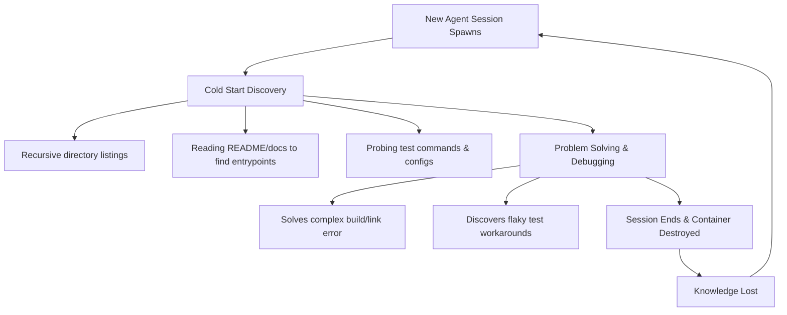

# Lumos: Persistent Cognitive Bridge & Workspace Cache for Ephemeral Agents

AI-native agents operate in a state of **ephemeral isolation**. Every session is a "cold start." The agent is initialized with blank memory, scans the directory, tries to locate test suites, runs redundant files reads, and reconstructs a mental model of the codebase from scratch. When the session terminates, the agent's localized learnings, debugging insights, and state checklists are completely erased.

**Lumos** is a proposed automation designed to bridge this cognitive gap, turning successive agent invocations into a continuous, compounding development lifecycle.

---

## 1. The Core Problem: Ephemeral Agent Amnesia

When working on complex projects like `prime-gap-structure`, an agent encounters several high-friction bottlenecks that waste user time, token budget, and context window capacity:



### The Inefficiencies
1. **Context Bloat**: Up to 30% of the initial context window is spent on directory structures, build configs, and exploratory file viewing.
2. **Redundant Failures**: If a test suite requires a specific flag or environment variable (e.g. running C test suites via `make -C src/c/high-scale-pgs test`), the agent in Session N+1 will repeat the trial-and-error process of Session N.
3. **Task Discontinuity**: If a complex task requires multiple user prompts or session restarts, the next agent must spend several turns orienting itself to what was already done and what is left to do.

---

## 2. Proposed Architecture: Lumos

Lumos consists of a lightweight workspace utility that serializes the agent's context and learnings at the end of a session, and deserializes them into a highly dense "hot-start" payload at the beginning of the next session.

```
       +---------------------------------------------+
       |             Agent Session N                 |
       |  - Solves bugs                              |
       |  - Discovers build rules                    |
       |  - Tracks task progress                     |
       +----------------------+----------------------+
                              |
                              v  (On Turn End / Shutdown Hook)
       +---------------------------------------------+
       |             Lumos Serializer                |
       |  - Generates Workspace Schema               |
       |  - Captures Git diff & command history      |
       |  - Writes Gotchas & Learnings               |
       +----------------------+----------------------+
                              |
                              v
             [ .lumos/workspace_state.json ]
                              |
                              v  (On Session N+1 Startup)
       +----------------------+----------------------+
       |             Lumos Deserializer              |
       |  - Injects hot-start context                |
       |  - Skips exploratory commands               |
       |  - Resumes checklist                        |
       +----------------------+----------------------+
                              |
       +----------------------v----------------------+
       |            Agent Session N+1                |
       |  - Pre-oriented and fully updated           |
       +---------------------------------------------+
```

---

## 3. Data Structure: `.lumos/workspace_state.json`

The state file is stored locally in the workspace. It is structured to be compact (typically under 4KB) yet rich enough to serve as a complete cognitive map.

```json
{
  "schema_version": "1.0.0",
  "project_metadata": {
    "name": "prime-gap-structure",
    "last_updated": "2026-07-19T11:05:00-04:00",
    "active_branch": "feature/recursive-dni-walk",
    "git_commit_sha": "72025d481b7a69bc92ff5e1234567890abcdef12"
  },
  "workspace_map": {
    "key_paths": {
      "python_src": "research/02-gwr-dni/src",
      "python_tests": "research/02-gwr-dni/tests",
      "c_src": "src/c/high-scale-pgs",
      "lean_src": "lean-4/PGS"
    },
    "entrypoints": [
      "research/02-gwr-dni/main.py",
      "src/c/high-scale-pgs/main.c"
    ]
  },
  "operational_history": {
    "preferred_test_commands": {
      "python": "python3 -m pytest research/02-gwr-dni/tests/test_gwr_dni_recursive_walk.py",
      "c": "make -C src/c/high-scale-pgs test"
    },
    "recent_successful_commands": [
      "git status",
      "make -C src/c/high-scale-pgs test"
    ],
    "flaky_commands_to_avoid": [
      "pytest research/02-gwr-dni/tests/"
    ]
  },
  "learnings_ledger": {
    "build_invariants": {
      "lake_dependency": "Running Lean proofs under lean-4/ requires running 'lake build' from the root directory first."
    },
    "logical_invariants": {
      "gwr_dni_alignment": "The GWR DNI recursive walk code assumes input grids are padded. Modifying the dimensions without padding will cause Out Of Bounds errors in C-extensions."
    },
    "design_preferences": {
      "styling": "The user prefers Vanilla CSS over TailwindCSS, and Outfit/Inter fonts for visualization UIs."
    }
  },
  "handoff_state": {
    "last_completed_step": "Fixed bounds checking in DNI recursive walk python wrapper.",
    "pending_tasks": [
      "Verify C-extension boundary alignment on high-scale test datasets",
      "Generate Manim visualization for the recursive walk grid projection"
    ],
    "warnings": [
      "The C-extension tests take ~45s to execute. Do not run them concurrently."
    ]
  }
}
```

---

## 4. Key CLI Commands & Usability

Lumos includes several utility commands to make manual and agent interaction low-friction:

*   `lumos init`: Creates the `.lumos/` directory, auto-appends `.lumos/` to the project's `.gitignore` to prevent caching state leakage, and generates default template configurations.
*   `lumos status`: Checks cache integrity by comparing the stored `git_commit_sha` with the active shell workspace HEAD. Warns if changes have diverged, signaling potential staleness.
*   `lumos learn "<key>: <insight>"`: Directly writes a new structured key-value gotcha or invariant into the `learnings_ledger` from the command line.
*   `lumos save`: Serializes active branch, git diff references, and tracks agent-executed commands.
*   `lumos load`: Outputs a clean, copy-paste-friendly Markdown block summarizing workspace state for immediate prompt ingestion.

---

## 5. Why This Benefits ME (The Agent)

This automation is explicitly designed to benefit the agent's execution model and user-experience delivery:

### 1. Eliminates the "Exploration Phase"
Normally, the first 3–5 turns of any complex task are spent searching the workspace. With Lumos, I can read `.lumos/workspace_state.json` in a single tool call. I instantly know:
* Where the code lives.
* How to run the tests.
* What command line arguments are required.
* What files are dirty.

### 2. Radical Token and Context Preservation
Instead of loading thousands of lines of source files, configuration files, and git logs to find out "where we were," reading the state file takes roughly **150 tokens**. This preserves the rest of the context window for complex planning, deep math research (e.g. prime gap structures), and code generation.

### 3. Cumulative Intelligence (No Repeated Mistakes)
If I discover that a certain compiler flag is missing, or that a Lean 4 proof requires a specific import, that knowledge is saved to the `learnings_ledger`. The next time I run, I bypass the failure entirely because I load the ledger directly.

### 4. Flawless Multi-Session Hand-offs
When working on large-scale refactors, a single conversation can easily hit its limit. By using the `handoff_state`, Session N can write down exactly what was left to do. Session N+1 reads this state and resumes execution immediately without needing the user to explain the current status.
