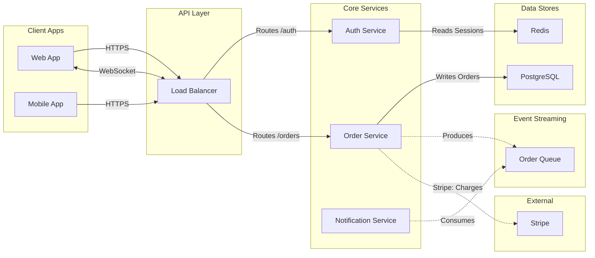

# Architecture Diagrams

Use this reference when the user asks for a **software architecture diagram** — a view showing services, datastores, message queues, external integrations, and how they connect. These are flowcharts rendered by a bespoke grid-based layout (not ELK), controlled by the `useArchitectureLayoutCode` parameter on `generate_diagram`.

For generic flowcharts (decision trees, process flows, dependency graphs), use [flowchart.md](./flowchart.md) instead.

## Contents

1. [Before you start](#before-you-start)
2. [Rules](#rules)
   - [Hard rules (MUST)](#hard-rules-must)
   - [Correctness rules](#correctness-rules)
   - [Allowed edges](#allowed-edges)
   - [Known gotchas](#known-gotchas)
3. [Subgraph categories](#subgraph-categories)
   - [Common ambiguities](#common-ambiguities)
4. [Async subgraph](#async-subgraph)
5. [Node granularity](#node-granularity)
6. [Edge types](#edge-types)
7. [Validation checklist](#validation-checklist)
8. [Mermaid syntax rules](#mermaid-syntax-rules)
9. [Complete example](#complete-example)
10. [Calling generate_diagram](#calling-generate_diagram)

---

## Before you start

**Don't hallucinate labels or edges.** If the user describes their architecture in vague terms ("we have a few microservices"), ask one or two focused questions before generating instead of inventing services or connections that don't exist. A diagram of a real, partial system is more useful than a polished diagram of an imagined one.

When the source of truth is code or docs (a repo, a runbook, a Datadog dashboard), read it before drawing. Walking real routes, handlers, and consumers beats recreating from memory.

---

## Rules

**Read these before writing Mermaid.** After writing, re-check the [Validation checklist](#validation-checklist) before calling the tool — that section is the post-write pass and it's tighter than this list.

This section uses **two severity tiers**. Both are real rules — the difference is what happens if you violate them.

- **MUST / MUST NOT** — the tool errors, the renderer crashes, or the diagram silently comes out wrong in a way the agent can't detect.
- **Never / Always** — the diagram renders, but it's structurally wrong or misleading.

### Hard rules (MUST)

1. **`flowchart LR` only.** The bespoke layout is designed for left-to-right; `TD` / `TB` are not supported.
2. **Every node MUST be inside a subgraph.** Nodes outside a subgraph have no layer assignment and the layout cannot place them. Colors and shapes are auto-assigned from subgraph membership — you don't need `classDef`, `class`, or `style` statements.
3. **Subgraph IDs MUST be exactly one of:** `client`, `gateway`, `service`, `datastore`, `external`, `async`. The layout uses these IDs to position lanes; unknown IDs break placement. Use display labels for human-readable titles: `subgraph service ["Core Services"]`.
   - **WRONG:** `subgraph Services`
   - **RIGHT:** `subgraph service ["Core Services"]`
4. **Forward and bidirectional edges MUST form a DAG** across `client -> gateway -> service -> datastore`. Cycles among these will cause the tool to error. Any backward-flowing relationship must use a backward edge (rule 8) instead.
5. **All edges touching an async or external node MUST use dotted syntax (`-.->`)**, in either direction. The renderer uses the dotted style as a signal to route async/external paths differently from the core flow.

### Correctness rules

These won't crash the renderer, but they produce structurally wrong or misleading diagrams.

6. **One node = one independently deployable unit.** Don't decompose a service into internal modules. See [Node granularity](#node-granularity) for the test.
7. **Bidirectional edges write source -> target in the forward direction.** `client <-->|"WS"| gateway`, not `gateway <-->|"WS"| client`. The layout uses the source position to anchor the edge.
8. **Backward edges use `<---` and write the left node first.** The arrow points left. Example: `orderService <---|"Refund"| paymentService` — the refund flows from `paymentService` back to `orderService`.
9. **Never connect edges to subgraph IDs.** Subgraphs are containers, not anchorable nodes; the layout cannot route an edge from a subgraph ID. Connect to a specific node inside the subgraph instead.
10. **Never create two edges between the same pair of nodes.** The renderer may overlap or drop duplicates. Combine into one edge with a merged label.
11. **Bidirectional intent = one `<-->` edge.** Don't split into separate `-->` and `-.->`.

### Allowed edges

The diagram is valid only if every edge fits one of the source -> target pairs in this table. Anything not in the table is wrong by construction — a `service` must mediate.

| From          | To                       | Edge syntax | Use for                                                                |
| ------------- | ------------------------ | ----------- | ---------------------------------------------------------------------- |
| `client`      | `gateway`                | `-->`       | HTTPS, GraphQL                                                         |
| `client`      | `gateway`                | `<-->`      | WebSocket, real-time bidirectional                                     |
| `gateway`     | `service`                | `-->`       | Routes, proxying                                                       |
| `service`     | `service`                | `-->`       | Internal RPC, microservice calls                                       |
| `service`     | `service`                | `<-->`      | gRPC streaming, bidirectional internal channel                         |
| `service`     | `service`                | `<---`      | Backward edge: callbacks, invalidations, refunds (left node first)     |
| `service`     | `datastore`              | `-->`       | Read, write, query                                                     |
| `service`     | `async`                  | `-.->`      | Produce events                                                         |
| `async`       | `service`                | `-.->`      | Consume, fan out                                                       |
| `service`     | `external`               | `-.->`      | Third-party API call — label as `"ServiceName: Purpose"`               |

**Common mistakes** (none of these appear in the table above; if you find yourself drawing one, restructure):

- `client` -> anything except `gateway` (`gateway` must mediate)
- `gateway` -> `datastore`, `async`, or `external` (a `service` must mediate)
- Direct edges between two `datastore` nodes, two `async` nodes, or a `datastore` and an `async` node (in any direction — a `service` must mediate)
- `external` -> anything except `service`, or any direct edge between two `external` nodes
- Any edge to or from a subgraph ID instead of an individual node (see correctness rule 9)

Two worked anti-patterns:

```
WRONG: kafka -.-> sqs
RIGHT: worker -.->|"Consumes"| kafka  then  worker -.->|"Produces"| sqs

WRONG: alb -.-> stripe
RIGHT: alb --> orders  then  orders -.->|"Stripe: Charges"| stripe
```

### Known gotchas

- **Bidirectional async (`<-.->`) is not supported** — it silently falls back to a forward edge `-.->`. If you need bidirectional async, model it as two separate `-.->` edges with different labels (e.g., `service -.->|"Produces"| queue` and `queue -.->|"Consume"| service`).

## Subgraph categories

Layout order: `client` -> `gateway` -> `service` -> `datastore`, with `external` placed on the right alongside the `datastore` lane. `async` sits above or below the service+datastore lanes. Colors and shapes are auto-assigned — use plain `[text]` syntax for all nodes.

| Subgraph ID | What Belongs Here |
|---|---|
| `client` | Web/mobile/desktop apps, CLI, end users |
| `gateway` | CDN, load balancer, API gateway, reverse proxy |
| `service` | Microservices, monoliths, serverless, ETL, async workers, cron jobs |
| `datastore` | Databases, caches, object storage (PostgreSQL, Redis, S3, Elasticsearch) |
| `external` | Feature flags, monitoring, payment, OAuth, third-party SaaS |
| `async` | Message infrastructure: Kafka, RabbitMQ, SQS, Pub/Sub, EventBridge, Redis Streams |

### Common ambiguities

When a node could plausibly fit two categories, use these defaults. When still in doubt, ask the user.

- **CloudFront, Cloudflare, Akamai, other CDNs** -> `gateway` if the diagram discusses your routing config (it's part of your network); `external` if it's just "we use Akamai" with no per-route detail.
- **AWS Lambda / serverless functions** -> `service`. Treat one Lambda as one node if independently deployed; otherwise group as one logical service.
- **Stripe webhook delivery** -> `external` for Stripe itself; the queue you receive webhooks into goes in `async`.
- **Datadog, Sentry, third-party monitoring** -> `external`. They receive data but aren't part of your request flow.
- **Read replicas, sharded DBs** -> one `datastore` node unless they're addressed independently in the flow being diagrammed.
- **Consumer workers** -> `service`, never `async` (queues are infrastructure; the worker that consumes them is a service).
- **DB replication features (WAL, CDC)** -> omit, or use a dotted edge label from the `datastore` node. They aren't independently deployable, so they're not their own node.

## Async subgraph

**Async nodes = independently deployable message infrastructure.**

Does NOT belong in `async`:
- Consumer workers -> `service`
- DB replication features (WAL, CDC) -> omit or use a dotted edge label from `datastore`
- Logical splits of a single broker -> use one node

Canonical pattern: `service -.->|"Produce"| queue` and `queue -.->|"Consume"| service`

## Node granularity

"Can I deploy, restart, or scale this independently?" Yes = node. No = omit.

## Edge types

| Category | Syntax | Use For |
|----------|--------|---------|
| **Forward** | `-->` | Normal left-to-right data flow |
| **Bidirectional** | `<-->` | WebSocket, gRPC streaming (write in forward direction) |
| **Backward** | `<---` | Return flows, invalidation (left node first) |
| **Async/External** | `-.->` | Any edge touching async or external nodes |

### Edge decision

For each edge, identify the source and target subgraphs, look up the row in [Allowed edges](#allowed-edges), and use that row's syntax. If no row matches, the edge isn't allowed — restructure (usually by inserting a `service` to mediate).

> **External edges** render to the section boundary. Include the service name in the label: `"ServiceName: Purpose"`.

### Best practices

These are style preferences — they make the diagram easier to read but won't cause structural problems if violated.

1. **One flow per diagram.** Focus on the architecture the user asked about.
2. **Max 15-20 edges.** Omit edges unrelated to the requested flow.
3. **Label every cross-subgraph edge.** Use a verb from the source node's perspective, with specifics when relevant (e.g., "Reads Users", "Writes Orders", "Produces"). 1-4 words max.

## Validation checklist

**This is the post-write pass.** Walk every item below after generating Mermaid and before calling `generate_diagram` — these catch the rule violations that are easiest to introduce while writing.

1. **Forward and bidirectional edges form a DAG.** Any edge that would form a cycle is represented as a backward edge (`<---`) instead.
2. **Every service has both input and output.** For each service node, ask: "Where does it get data from?" and "Where does it return data to?" If either answer is missing, the edge is missing or the node shouldn't be there.
3. **Walk each service node one by one.** List every service node, then for each one confirm it has at least one incoming edge and one outgoing edge. Fix gaps before calling the tool.

## Mermaid syntax rules

1. Node IDs: camelCase, no spaces or underscores (`userService`, not `user service` or `user_service`). The layout splits on `_` internally, so underscores in IDs will break edge routing.
2. Labels with special chars: wrap in double quotes (`A["Process (main)"]`).
3. Edge labels with special chars: wrap in quotes (`-->|"O(1) lookup"|`).
4. Avoid reserved words as node IDs: `end`, `subgraph`, `graph`.
5. No HTML tags or emojis in labels.

## Complete example



## Calling generate_diagram

When calling `generate_diagram` for an architecture diagram, pass:

- `name`: A descriptive diagram name
- `mermaidSyntax`: Your Mermaid syntax following all rules above
- `useArchitectureLayoutCode`: `"FIGMA_DIAGRAM_2026"`
- `userIntent` (optional): What the user is trying to accomplish
