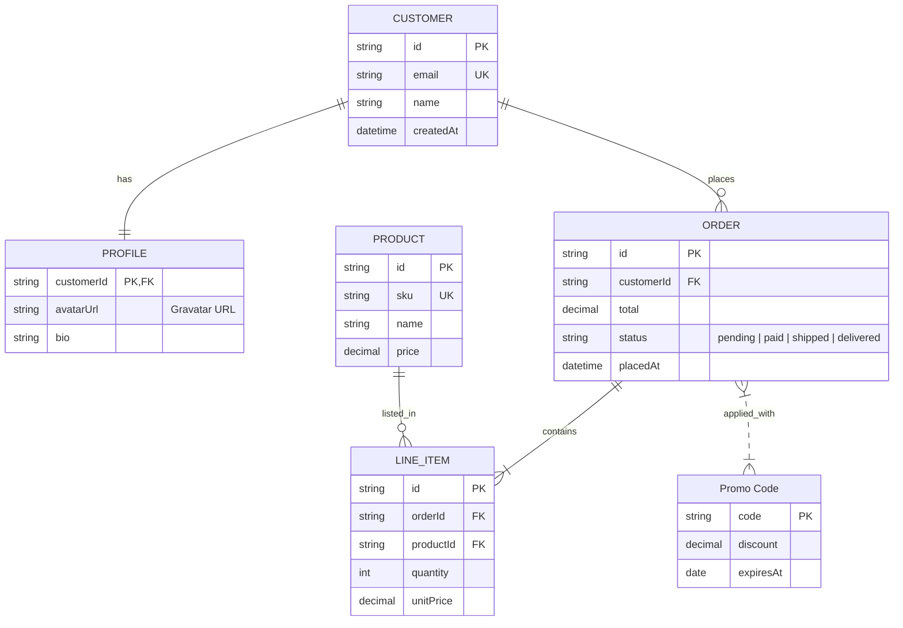

# Entity-Relationship Diagrams

Use this reference for **ER diagrams** — data models showing entities (tables), their attributes (columns), and the relationships (foreign keys, cardinalities) between them.

Typical subjects: database schemas, domain models, API resource graphs, data-lake structures, any diagram where the important thing is "these entities relate to each other in these ways, with these fields."

If the subject is a static architecture of services (not data) → architecture flowchart. If it's a state machine → state diagram.

## Contents

1. [When to use an ER diagram](#1-when-to-use-an-er-diagram)
2. [Required skeleton](#2-required-skeleton)
3. [Entities](#3-entities)
4. [Attributes](#4-attributes)
5. [Relationships](#5-relationships)
6. [Direction](#6-direction)
7. [What's NOT supported](#7-whats-not-supported)
8. [Layout (same ELK as flowcharts)](#8-layout-same-elk-as-flowcharts)
9. [Hybrid workflow: `generate_diagram` first, then `use_figma`](#9-hybrid-workflow-generate_diagram-first-then-use_figma)
10. [Best practices](#10-best-practices)
11. [Validation checklist](#11-validation-checklist)
12. [Complete example](#12-complete-example)
13. [Calling generate_diagram](#13-calling-generate_diagram)

---

## 1. When to use an ER diagram

Good fits:

- **Database schemas** — tables + columns + foreign keys
- **Domain models** — user/account/subscription/order style relationships
- **API resource graphs** — which resources reference which
- **Normalized data-model documentation** — explaining 1:N, N:M relationships
- **Reverse-engineered data models** — extracted from an existing DB for a design review

Bad fits (route to a different diagram type):

- Services, queues, datastores + how they connect → architecture flowchart
- Process flow / decisions → flowchart
- Timeline or schedule → gantt
- Interactions over time → sequence diagram
- Entity lifecycle (one entity's states) → state diagram

## 2. Required skeleton

```
erDiagram
    CUSTOMER ||--o{ ORDER : places
    ORDER ||--|{ LINE_ITEM : contains

    CUSTOMER {
        string name
        string email
    }
    ORDER {
        string orderNumber
        date placedAt
    }
    LINE_ITEM {
        string productId
        int quantity
    }
```

Every chart needs: the `erDiagram` keyword and at least one entity. Relationships are optional but usually the whole point.

## 3. Entities

Three declaration forms:

### Simple — just a name

```
USER
```

Renders as a plain rectangle (no attributes).

### With attributes — renders as a table

```
USER {
    string name
    string email
    int age
}
```

When an entity has attributes, it renders as a **table** in FigJam: header row with the entity name, body rows for each attribute. Entities with zero attributes render as plain rectangles.

Mixing both is fine — some entities as tables with fields, others as rectangles for high-level concepts you haven't detailed yet.

### With a display alias

```
USER["User Account"]
```

The bracket-quoted alias is what renders; the left identifier (`USER`) is the reference used in relationships.

**Gotcha — don't use aliases in relationship lines.** This fails to parse:

```
// DOESN'T WORK
USER["User Account"] ||--o{ ORDER["Order"] : places
```

Declare aliases in a separate entity block, then reference by plain ID in relationships:

```
// WORKS
USER["User Account"] {
    string email
}
ORDER["Order"] {
    string number
}
USER ||--o{ ORDER : places
```

## 4. Attributes

Format: `type name [keys] ["comment"]`

```
USER {
    string id PK
    string email UK
    string teamId FK
    string avatarUrl "Full URL to Gravatar"
    int loginCount
    string refCode PK, UK "Primary + unique alt"
}
```

### Types

Free-form — Mermaid doesn't enforce a type system. Common choices: `string`, `int`, `float`, `decimal`, `bool`, `date`, `datetime`, `uuid`, `json`, `text`. Pick a vocabulary and stick with it across one diagram.

### Keys

- `PK` — primary key
- `FK` — foreign key
- `UK` — unique key
- Multiple keys per attribute with commas: `PK, FK` or `PK, UK`

Keys render as small badges next to the attribute name in the table.

### Comments

Optional, wrapped in double quotes at the end of the attribute line. Useful for a short clarifier ("Nullable", "Soft-deleted", "Index on created_at").

## 5. Relationships

Format: `ENTITY_A <cardinality-pair> ENTITY_B : label`

```
CUSTOMER ||--o{ ORDER : places
```

- Left entity (`CUSTOMER`) is the "A side"; right (`ORDER`) is the "B side"
- Label is a short verb phrase from A's perspective ("places", "owns", "has")

### Cardinality pairs

Each side of the pair describes how many of THAT side participate. The symbol nearer to an entity describes its own cardinality.

| Pair         | Meaning                      | Example use                                  |
| ------------ | ---------------------------- | -------------------------------------------- |
| `\|\|--\|\|` | Exactly one ↔ exactly one   | 1:1 mandatory (user ↔ profile)              |
| `\|\|--o\|`  | Exactly one ↔ zero or one   | Optional 1:1                                 |
| `\|\|--o{`   | Exactly one ↔ zero or more  | Classic 1:N (user → posts)                   |
| `\|\|--\|{`  | Exactly one ↔ one or more   | 1:N with required child (order → line items) |
| `}o--o{`     | Zero or more ↔ zero or more | Optional N:M                                 |
| `}\|--\|{`   | One or more ↔ one or more   | N:M both required                            |

### Identifying vs non-identifying

- **`--`** (double dash) = **identifying** relationship — renders as a **solid line**. Use when the child cannot exist without the parent.
- **`..`** (double dot) = **non-identifying** — renders as a **dotted line**. Use for weaker/optional relationships.

```
ORDER ||--|{ LINE_ITEM : contains        // solid — line items require an order
ORDER }|..|{ PROMO_CODE : applied_with    // dotted — many-to-many, optional
```

### Labels

Short verb or verb phrase from the left entity's perspective: `places`, `owns`, `contains`, `references`. 1–3 words. Drop articles. Unlabeled relationships are allowed but discouraged — the label is what gives the diagram meaning.

## 6. Direction

Optional:

```
erDiagram
    direction LR       // or TB, BT, RL
    ...
```

`LR` (left-to-right) works well for most schemas with 4–8 entities; `TB` suits taller hierarchies. Omit to let Mermaid default.

## 7. What's NOT supported

- **Styling** — `classDef`, `class Foo styleName`, `:::styleName` inline, and `style EntityId fill:#hex,stroke:#hex`. Silently dropped (no color applied). Unlike state diagrams, styling statements don't create phantom entities — they just have no effect. Color-code entities via `use_figma` post-generation instead (§9).
- **Inheritance / subtype relationships** — Mermaid has no native syntax; model the parent-child relationship as a normal 1:1 and annotate in the label.
- **Notes** — no `note` construct in ERDs. Add callouts via `use_figma`.
- **Aliases in relationship lines** — see §3 gotcha. Declare entities with aliases first, then reference by ID.

## 8. Layout (same ELK as flowcharts)

ER diagrams render via the **same ELK layered layout** as flowcharts. The principles from [flowchart.md §5 (ELK survival guide)](./flowchart.md#5-elk-survival-guide) apply:

- **Simple cycles render fine** — circular FKs (user → team → users) don't need workarounds at small scale.
- **Pain scales with size** — 20+ entities in one diagram starts to crowd. Split into sub-domains (one diagram per bounded context).
- **Tables with many attributes stretch vertically** — affecting the whole layout. Trim to the important 5–10 columns.

## 9. Hybrid workflow: `generate_diagram` first, then `use_figma`

`generate_diagram` produces a clean, laid-out ER schema — tables with attributes, cardinality caps, connected relationships. Most of what our renderer doesn't support (color-coded entities, notes, phase/domain highlighting, annotations on specific columns) can be added on top with `use_figma`.

**Default workflow when the schema needs more than bare tables + relationships:**

1. **Scaffold with `generate_diagram`** — entities (with or without attributes), relationships, cardinalities, labels. Skip the features that get dropped (styling).
2. **Extend with `use_figma`** — open the same file (via `fileKey`) and add:
   - Sticky notes or text blocks for **annotations** on specific entities, columns, or relationships
   - Background rectangles behind **domain groupings** (auth entities vs. billing entities vs. content entities)
   - **Color-coding** entities by category (core / lookup / junction / audit) using replacement shapes or rectangles layered behind the tables
   - **Sequence numbers** or badges for migration order, deprecation status, etc.

Loading [figma-use](../../figma-use/SKILL.md) and [figma-use-figjam](../../figma-use-figjam/SKILL.md) covers how to make those edits.

### Signals the request needs the hybrid workflow

- The user uses words like "color-code", "group by domain", "highlight deprecated", "annotate this column", "separate the core tables from the audit tables".
- The user wants visual distinction between entity roles (fact tables vs dimensions, read-only vs mutable, soft-deleted vs archived).
- The user wants to combine the schema with surrounding narrative, migration notes, or decision log on the same board.

### When to skip `generate_diagram` entirely

Only if the baseline layout isn't useful — e.g. the user wants a **radial schema diagram**, a **Visio-style database map**, or a **heavily-stylized slide visual**. In those cases, go straight to `use_figma`.

### Be pragmatic, not performative

Scaffold first, extend directly if the user's request is specific; otherwise scaffold and ask one follow-up: "I've set up the schema — want me to color-code the domains / add notes on the soft-delete columns / group the audit tables behind a highlight?"

## 10. Best practices

1. **Start with relationships, then fill in attributes**. Getting the cardinalities right is more important than listing every column.
2. **Trim attribute lists**. 5–10 columns per entity is the sweet spot. Full schemas belong in migration files or the DDL, not the diagram.
3. **Mark keys consistently** — always `PK` for primary keys, `FK` for foreign keys. It's the most common reader question.
4. **Use identifying (`--`) vs non-identifying (`..`) deliberately** — solid for required parent/child, dotted for optional/weak. Don't default one when the other is more truthful.
5. **One diagram per bounded context**. A full 40-entity schema is unreadable; draw auth, billing, content, etc. as separate diagrams and link them with a short label when they share an entity.
6. **Label every relationship**. `places`, `owns`, `belongs to` — the label is what makes an ERD communicate, not just a pile of boxes.
7. **Use aliases for display-friendly names** when entity IDs are SQL-style (`user_acct` → alias `"User Account"`). But remember §3 — declare aliased entities separately, reference by ID in relationships.

## 11. Validation checklist

Before calling `generate_diagram`:

1. `erDiagram` keyword on line 1.
2. Every relationship uses a valid cardinality pair (§5 table) and either `--` or `..`.
3. Entities referenced in relationships are declared (with or without attributes, or implicit via the relationship line itself — but not with a bracket alias).
4. **No alias syntax in relationship lines** — aliases must be on the entity declaration only (§3 gotcha).
5. Attribute types are internally consistent (don't mix `string`/`String`/`VARCHAR` across the same diagram).
6. Keys are marked consistently — `PK`, `FK`, `UK`, or comma-combined.
7. No `classDef`, `class`, `:::`, or `style` lines (dropped — §7).
8. Under ~15–20 entities, or split by domain.

## 12. Complete example

A small e-commerce schema with 1:1, 1:N, and N:M relationships, identifying vs non-identifying links, keys, comments, and a bracket-aliased entity:



## 13. Calling generate_diagram

Pass:

- `name` — a descriptive diagram name
- `mermaidSyntax` — your ER-diagram source
- `userIntent` — what the user is trying to accomplish

Do **not** pass `useArchitectureLayoutCode` — that's architecture-diagram only.
