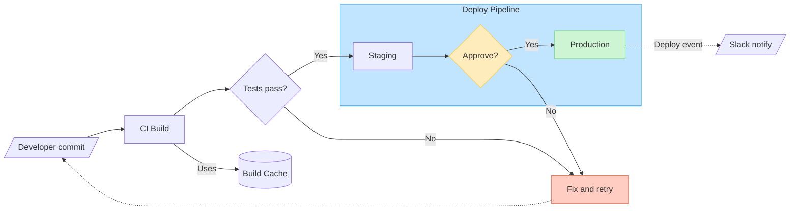

# Flowcharts (non-architecture)

Use this reference for **generic flowcharts** — decision trees, process flows, pipelines, dependency graphs, user journeys, anything that is not a software architecture diagram (those go to [architecture.md](./architecture.md)).

These diagrams render via ELK (Eclipse Layout Kernel) with an orthogonal, layered layout. The rules below are tuned to produce diagrams that read well, use FigJam's shape vocabulary, and avoid the layout traps ELK struggles with.

## Contents

1. [Direction: pick once, up front](#1-direction-pick-once-up-front)
2. [Shapes: use the vocabulary, don't over-decorate](#2-shapes-use-the-vocabulary-dont-over-decorate)
3. [Edges: strokes, end caps, labels](#3-edges-strokes-end-caps-labels)
4. [Subgraphs: group related nodes](#4-subgraphs-group-related-nodes)
5. [ELK survival guide](#5-elk-survival-guide)
6. [Colors: use sparingly, semantically](#6-colors-use-sparingly-semantically)
7. [Text quality](#7-text-quality)
8. [Density and when to split](#8-density-and-when-to-split)
9. [Validation checklist (before calling the tool)](#9-validation-checklist-before-calling-the-tool)
10. [Complete example](#10-complete-example)
11. [When a flowchart is NOT the right choice](#11-when-a-flowchart-is-not-the-right-choice)
12. [Calling generate_diagram](#12-calling-generate_diagram)

---

## 1. Direction: pick once, up front

- `flowchart LR` — **default**. Best for sequential processes, pipelines, dependency chains, most 2–3 level decision trees.
- `flowchart TD` (or `TB`) — switch when you have hierarchies, taxonomies, deep narrow trees, or many sibling nodes at the same level (keeps width manageable).

Never change direction mid-diagram. Pick before writing.

## 2. Shapes: use the vocabulary, don't over-decorate

Mermaid exposes dozens of shape names; most silently fall back to a plain rectangle in FigJam. The table below lists **only the shapes that render as a distinct FigJam shape** — prefer these when they carry meaning.

| Mermaid short form | `@{shape: ...}` form      | Renders as                  | Use for                          |
| ------------------ | ------------------------- | --------------------------- | -------------------------------- |
| `A[Text]`          | `shape: rect` / `square`  | Rectangle                   | Generic process / step (default) |
| `A(Text)`          | `shape: rounded`          | Rounded rectangle           | Softer step, grouped process     |
| `A([Text])`        | `shape: stadium`          | Rounded rectangle (stadium) | Start / end of a flow            |
| `A((Text))`        | `shape: circle`           | Ellipse                     | Entry/exit points, events        |
| `A{Text}`          | `shape: diamond`          | Diamond                     | **Decisions** (yes/no, branch)   |
| `A{{Text}}`        | `shape: hexagon` / `hex`  | Hexagon                     | Preparation, setup, handoff      |
| `A[[Text]]`        | `shape: subroutine`       | Predefined process          | Called function / sub-procedure  |
| `A[(Text)]`        | `shape: cylinder` / `cyl` | Database                    | Any datastore (DB, cache, store) |
| `A[/Text/]`        | `shape: lean-r`           | Parallelogram right         | Input                            |
| `A[\Text\]`        | `shape: lean-l`           | Parallelogram left          | Output                           |
| `A[/Text\]`        | `shape: trap-t`           | Trapezoid                   | Manual operation                 |
| `A[\Text/]`        | `shape: trap-b`           | Trapezoid                   | Manual operation (inverse)       |
| `A>Text]`          | `shape: odd`              | Chevron                     | Tag, marker, flag                |
| —                  | `shape: doc`              | Document                    | File, report, artifact           |
| —                  | `shape: docs`             | Documents (multiple)        | Collection of files              |
| —                  | `shape: tri`              | Triangle (up)               | Hierarchy root, warning          |
| —                  | `shape: flip-tri`         | Triangle (down)             | Inverse hierarchy                |
| —                  | `shape: notch-pent`       | Pentagon                    | Milestone, status                |
| —                  | `shape: comment`          | Speech bubble               | Annotation                       |
| —                  | `shape: cross-circ`       | Summing junction            | Merge / combine                  |

**Shapes the parser accepts but that render as plain rectangles** — don't bother using these for visual distinction: `text`, `notch-rect`, `lin-rect`, `fork`, `hourglass`, `brace-r`, `braces`, `bolt`, `delay`, `das`, `curv-trap`, `div-rect`, `win-pane`, `sl-rect`, `processes`, `flag`, `bow-rect`, `tag-rect`, `subproc`.

### The "shape carries the label" principle

Don't repeat a shape's semantics in its text:

- BAD: `db[(Database: PostgreSQL)]` — the cylinder already says "database"
- GOOD: `db[(PostgreSQL)]`
- BAD: `d{Decision: user authenticated?}` — the diamond already says "decision"
- GOOD: `d{User authenticated?}`

All-rectangles is boring but often correct. All-decorative-shapes is worse — it turns the diagram into shape soup and distracts from flow.

## 3. Edges: strokes, end caps, labels

### Strokes

| Syntax     | FigJam stroke | Use for                                       |
| ---------- | ------------- | --------------------------------------------- |
| `A --> B`  | Normal        | Default data/control flow                     |
| `A -.-> B` | Dotted        | Async, conditional, optional, "happens later" |
| `A ==> B`  | Thick         | Critical path / emphasized flow               |

### End caps

| Syntax    | End cap | Use                         |
| --------- | ------- | --------------------------- |
| `A --> B` | Arrow   | Default                     |
| `A --o B` | Circle  | Composition, "ends at"      |
| `A --x B` | Cross   | Termination, error, blocked |
| `A --- B` | None    | Plain association           |

### Both-ended

| Syntax     | Meaning                                    |
| ---------- | ------------------------------------------ |
| `A <--> B` | Bidirectional (write in forward direction) |
| `A o--o B` | Both circles                               |
| `A x--x B` | Both crosses                               |

### Labels

Syntax: `A -->|"label text"| B`. Wrap in quotes when there are special chars.

Label rules:

- 1–4 words, from the **source's** perspective (action verbs: "Writes", "Validates", "Returns 401")
- No trailing periods
- No emojis (tool rejects)
- Don't label the obvious — unlabeled edges are fine when the flow is clear

### Backward edges

ELK lays out left-to-right (or top-to-bottom). A "backward" edge forces ELK to bend around existing nodes and usually looks messy. Two options:

1. Reverse the syntax: `B <-- A` (left node first, arrow points left). ELK still bends, but at least labels correctly.
2. **Preferred when the back-reference is to a shared node**: duplicate the target (see §5).

### Chaining fan-out and fan-in

Mermaid accepts an `&` shortcut that's less verbose than listing each edge:

```
A --> B & C & D        // one-to-many
A & B & C --> sink     // many-to-one
A & B --> C & D        // many-to-many
```

Use this when the list is short and the intent is obvious. For larger or labeled groups, the explicit form reads better.

### Comments

`%% comment text` — parsed as a comment, ignored by the renderer. Useful in longer diagrams to label sections of Mermaid for the next agent/reader that touches the file. Do not overuse, since the user won't usually directly read the mermaid you write.

## 4. Subgraphs: group related nodes

Subgraphs are labeled containers. Syntax:

```
subgraph api ["API Layer"]
    auth[Auth]
    users[Users]
end
```

### When to use

- Clear logical boundary (subsystem, phase, team ownership)
- 3+ related nodes that share an input or output
- Don't subgraph a pair — not worth the visual weight

### Cross-subgraph edges

Work cleanly thanks to `elk.hierarchyHandling: INCLUDE_CHILDREN`. Connect a node inside one subgraph to a node inside another, or to a top-level node — ELK keeps routing orthogonal.

Always connect **node-to-node**. Connecting to a subgraph ID (`api --> db`) works but routes unpredictably; connect to a specific node inside instead.

### Nested subgraphs

Supported. Keep nesting to 2 levels max — deeper nesting crowds labels and confuses ELK's spacing.

### Style subgraphs so they stand out

FigJam's canvas is near-white. Unstyled subgraphs show only a thin outline and can blend into the background, especially with a dotted grid. Apply a light fill to each subgraph so boundaries read at a glance:

```
style tier1 fill:#FFECBD,stroke:#FFC943
style tier2 fill:#C2E5FF,stroke:#3DADFF
style eng   fill:#DCCCFF,stroke:#874FFF
```

Pick soft tints — not saturated colors. The [FigJam built-in palette](#6-colors-use-sparingly-semantically) light fills work well. When a diagram has multiple subgraphs, give each a different tint; when it has one, a neutral `#F5F5F5` fill with a darker stroke is usually enough.

Don't style subgraphs so heavily that they overpower the nodes inside them — subgraphs are containers, not the content.

### Per-subgraph direction

Override the parent's direction inside a subgraph when one cluster reads differently:

```
flowchart LR
    subgraph phases ["Phases"]
        direction TB
        p1[Phase 1] --> p2[Phase 2] --> p3[Phase 3]
    end
```

Use sparingly — mixed directions can disorient the reader.

## 5. ELK survival guide

ELK is more capable than you'd think. Small and medium diagrams render well out of the box — a linear pipeline with a loopback, a handful of services fanning into one, a long retry cycle, a few cross-subgraph edges — none of these need special care. **Don't pre-emptively contort the Mermaid** to avoid these patterns.

The guidance below is for the minority of cases where a diagram has visibly crossing edges, long horseshoe bends, or crowded subgraphs. Reach for it when something specific looks bad, not by default. Also note: not every visual oddity is ELK's fault — the FigJam renderer occasionally reparents coordinates in ways that override ELK's bend points. If a diagram looks slightly off, don't assume your Mermaid is wrong.

### Cycles

Draw cycles when they reflect the real flow. A single cycle — even one that spans the full length of the diagram back to the start — typically renders fine. Retry loops, state-machine transitions, reopen-ticket flows: don't avoid them.

The only time cycles start to hurt is when **many** cycles are tangled through the same nodes in an already-dense region. If that's happening, split the diagram or duplicate a shared node (below) — otherwise leave cycles alone.

### Duplicate shared nodes when fan-in becomes a problem

A shared node with up to ~5 inbound edges renders cleanly — ELK fans in without drama, even across subgraphs. **Don't pre-emptively duplicate.**

Duplication starts to earn its keep when:

- **Roughly 6+ inbound edges** converge on a single node — past this, arrows start stacking at the target and readability drops.
- The shared node sits many layers away from some of its sources, producing long crossings across other important content.
- The inbound edges visually cut across other subgraphs or flows in a way that obscures them.

Pattern — only apply when fan-in is _actually_ causing a rendering problem:

```
// Before — one shared Logger with many inbound edges crowding the target
a --> logger
b --> logger
... (6+ sources)
f --> logger
g --> logger

// After — duplicated inline per source
a --> aLog[Logger]
b --> bLog[Logger]
... (one Logger per source)
f --> fLog[Logger]
g --> gLog[Logger]
```

The reader sees "Logger" repeated and understands it's one shared concept. Readability beats node-count minimization — but only when readability is actually suffering.

### Balance your layers

If one layer has 20 nodes and neighboring layers have 2 each, ELK spreads the wide layer horizontally and the diagram becomes a thin strip. Either split the diagram or re-cluster into subgraphs.

### Avoid empty or trivial subgraphs

A subgraph with one child wastes space. A subgraph with no internal structure adds noise. Use subgraphs only when they clarify boundaries.

### Self-loops

Supported (`a --> a`). Leave headroom; tight grids of self-loops render awkwardly.

### Iterating when something looks off

If a first render comes back cluttered in a specific area (crossing edges around one node, a long horseshoe cycle, a cramped subgraph), the usual fixes in priority order:

1. **Split the diagram** — is this really one diagram, or two?
2. **Duplicate the most-referenced node** in the cluttered area.
3. **Introduce or tighten a subgraph** to cluster the nodes involved.
4. **Flip direction** (LR ↔ TD) if the aspect ratio is fighting the content.

## 6. Colors: use sparingly, semantically

Syntax:

```
style A fill:#E6F4EA,stroke:#137333
```

Or via classDef:

```
classDef warn fill:#FCE8E6,stroke:#C5221F
class A,B warn
```

Only `fill` and `stroke` are applied. Other CSS-like properties (font size, stroke-width, stroke-dasharray) are ignored. Keep it to fills and strokes.

**Use color to encode meaning**, not for decoration:

- Status (green = success, red = error, amber = warning)
- Ownership (team A vs team B)
- Subsystem grouping when subgraphs aren't appropriate

**Don't**:

- Paint every node
- Use bright saturated palettes — FigJam's canvas is neutral and bright fills fight with it
- Rely on color alone for meaning (shape + label should still read without color)

Prefer soft fills with darker matching strokes. The table below is the **FigJam built-in color palette** — these hex pairs match FigJam's native shape presets, so diagrams using them feel consistent with the canvas and with other FigJam content. The agent is free to pick any hex, but these are strong defaults.

**Light fills (use dark text — `#1E1E1E`):**

| Name         | Fill      | Stroke    | Typical use                |
| ------------ | --------- | --------- | -------------------------- |
| Light green  | `#CDF4D3` | `#66D575` | Success, completed, go     |
| Light teal   | `#C6FAF6` | `#5AD8CC` | Secondary success, info    |
| Light blue   | `#C2E5FF` | `#3DADFF` | Neutral highlight, focus   |
| Light violet | `#DCCCFF` | `#874FFF` | Special / callout          |
| Light pink   | `#FFC2EC` | `#F849C1` | Accent, creative           |
| Light red    | `#FFCDC2` | `#FF7556` | Error, blocked, critical   |
| Light orange | `#FFE0C2` | `#FF9E42` | Warning, attention         |
| Light yellow | `#FFECBD` | `#FFC943` | Caution, pending           |
| Light gray   | `#D9D9D9` | `#B3B3B3` | Muted, deprecated, context |

**Saturated fills (paired with darker stroke — use for strong emphasis; FigJam uses white text on these, but Mermaid can't set text color, so prefer light fills when labels are dense):**

| Name   | Fill      | Stroke    |
| ------ | --------- | --------- |
| Green  | `#66D575` | `#3E9B4B` |
| Blue   | `#3DADFF` | `#007AD2` |
| Red    | `#FF7556` | `#DC3009` |
| Orange | `#FF9E42` | `#EB7500` |
| Yellow | `#FFC943` | `#E8A302` |

Example:

```
style ok fill:#CDF4D3,stroke:#66D575
style broken fill:#FFCDC2,stroke:#FF7556
style pending fill:#FFECBD,stroke:#FFC943
```

## 7. Text quality

- **Node labels**: 1–4 words, a noun phrase or short imperative
- **Edge labels**: 1–4 words, verb from the source's perspective
- No trailing periods
- No emojis (tool rejects)
- No HTML tags
- Don't use `\n` in labels — omit line breaks unless absolutely necessary; ELK sizes shapes based on label and long labels stretch them awkwardly
- Node IDs: camelCase (`userService`). Underscores can break edge routing.
- Avoid `end`, `subgraph`, `graph` as node IDs (reserved)
- Labels with special chars (parens, colons, slashes): wrap in quotes — `A["Process (main)"]`, `-->|"O(1) lookup"|`

## 8. Density and when to split

Soft caps:

- Up to ~20 nodes — usually fine
- 20–30 — consider introducing subgraphs
- 30+ — split into multiple diagrams

Reasons to split into multiple diagrams:

- Multiple phases that don't interact (one diagram per phase)
- Different audiences (ops view vs. user view of the same system)
- Different scenarios through the same system (happy path vs. error path)

`generate_diagram` can be called repeatedly; multiple diagrams in a single FigJam file is a legitimate pattern. Name them distinctly.

## 9. Validation checklist (before calling the tool)

1. **Cycle check**: cycles exist only where they genuinely represent the flow. A single cycle or a couple of short retry loops are fine at any size. Multiple cycles tangled through shared nodes, especially inside an already-dense region, warrant splitting the diagram or duplicating a shared node.
2. **No orphans**: every node has at least one incoming or outgoing edge (excepting clear start/end nodes).
3. **Every process has input and output**: walk each node; if it's missing either, either the edge is missing or the node shouldn't be there.
4. **Label audit**: shape doesn't repeat in the label; edge labels from source side; under 4 words; no periods/emojis.
5. **Shape audit**: each non-rectangle shape earns its distinctness. Default to rectangle when unsure.
6. **Color audit**: color encodes meaning, or there's no color. Not every node is colored.
7. **Subgraph audit**: each subgraph has 3+ children with a clear shared boundary; each subgraph has a light tint applied via `style` so it stands out from the FigJam canvas.
8. **Density check**: ≤ ~25 nodes or the diagram is split.

## 10. Complete example

A CI/CD pipeline with decisions, a datastore, a subgraph, and semantic color:



## 11. When a flowchart is NOT the right choice

Route back to [SKILL.md](../SKILL.md) and pick a different diagram type if the user wants:

- **Interactions over time between parties** → sequence diagram
- **Data model / entity relationships** → ER diagram
- **State machine with explicit states and transitions** → state diagram
- **Project schedule with dates** → gantt chart
- **Software architecture (services, datastores, queues)** → [architecture.md](./architecture.md)
- **Pie, mindmap, venn, class diagram, journey, timeline, quadrant** → not supported by `generate_diagram`; tell the user directly

## 12. Calling generate_diagram

Pass:

- `name`: descriptive diagram name
- `mermaidSyntax`: your Mermaid flowchart
- `userIntent` (optional): what the user is trying to accomplish
- **Do NOT pass** `useArchitectureLayoutCode` for generic flowcharts
