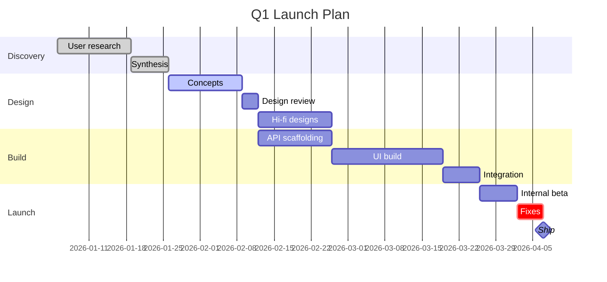

# Gantt Charts

Use this reference for **gantt charts** — project timelines, roadmaps, phased work, sprint plans, launch calendars, anything where the primary dimension is time and items have a start, duration, and optionally a dependency on other items.

If the user wants an abstract dependency graph (A depends on B) without specific dates, use a **flowchart** instead. Gantt is for time-on-an-axis.

## Contents

1. [When to use a gantt chart](#1-when-to-use-a-gantt-chart)
2. [Required skeleton](#2-required-skeleton)
3. [dateFormat](#3-dateformat)
4. [Sections](#4-sections)
5. [Task syntax](#5-task-syntax)
6. [Task tags (states)](#6-task-tags-states)
7. [Milestones](#7-milestones)
8. [Intra-day charts (time-of-day)](#8-intra-day-charts-time-of-day)
9. [What's NOT supported](#9-whats-not-supported)
10. [Limitations and gotchas](#10-limitations-and-gotchas)
11. [When gantt syntax isn't enough: build a custom timeline instead](#11-when-gantt-syntax-isnt-enough-build-a-custom-timeline-instead)
12. [Best practices](#12-best-practices)
13. [Validation checklist](#13-validation-checklist)
14. [Complete example](#14-complete-example)
15. [Calling generate_diagram](#15-calling-generate_diagram)

---

## 1. When to use a gantt chart

Good fits:

- **Project roadmaps** — initiatives across quarters or months
- **Release plans** — milestones leading to a launch
- **Sprint / iteration plans** — tasks across a 1–4 week window
- **Event schedules** — intra-day or multi-day agendas

Bad fits (route to a different diagram type):

- Abstract dependency trees without dates → flowchart
- API call sequence between services → sequence diagram
- State machine → state diagram
- Data model → ER diagram

## 2. Required skeleton

```
gantt
    title Project Timeline
    dateFormat YYYY-MM-DD
    section Phase 1
    Research        :r1, 2026-01-05, 10d
    Prototype       :p1, after r1, 7d
    section Phase 2
    Build           :b1, 2026-01-25, 3w
    Launch prep     :l1, after b1, 5d
```

Every chart needs: the `gantt` keyword, a `dateFormat` directive (`YYYY-MM-DD` for date charts, `HH:mm` for intra-day — see §3), and at least one task with a real start. `title` is optional but strongly recommended.

## 3. dateFormat

Two reliable formats, pick one based on the chart's time scale:

- **`dateFormat YYYY-MM-DD`** — the default. Use for any chart with day-or-larger granularity (sprints, roadmaps, launch plans).
- **`dateFormat HH:mm`** — intra-day only. Tasks are time-of-day starts; see §8 for the full setup.

Other formats (`DD/MM/YYYY`, `MM-DD-YYYY`, full datetimes) may parse but can hit the preprocessing layer and produce unexpected output. Stick to the two forms above.

## 4. Sections

```
section <Section Name>
```

Sections are horizontal lanes in the rendered chart. Use them to group tasks by:

- **Phase** (Discovery / Build / Launch)
- **Team or owner** (Design / Eng / Marketing)
- **Workstream** (Frontend / Backend / Infra)

Every task after a `section` declaration belongs to that section until the next `section`. You can omit sections entirely for short charts, and tasks will render in one lane.

## 5. Task syntax

Canonical form:

```
<Task name> :<tags>, <id>, <start>, <duration-or-end>
```

Tags and ID are optional; `<Task name>`, start, and duration/end are the minimum. Start can be an absolute date or a dependency on another task.

### Forms (all supported)

| Form                        | Example                             | When to use                             |
| --------------------------- | ----------------------------------- | --------------------------------------- |
| Absolute start + duration   | `Kickoff :2026-01-05, 3d`           | Simple timeline entry                   |
| Named + absolute + duration | `Kickoff :k1, 2026-01-05, 3d`       | You'll reference this task from another |
| Single-dep + duration       | `Design :d1, after k1, 5d`          | Starts when `k1` ends                   |
| Multi-dep + duration        | `Build :b1, after d1 r1, 2w`        | Starts after the latest of `d1` or `r1` |
| Explicit end date           | `Phase :p1, 2026-01-05, 2026-02-01` | You know both endpoints                 |
| Milestone (absolute)        | `Launch :milestone, 2026-03-01, 0d` | Zero-duration marker                    |

### Duration units

`y` (years), `M` (months — **capital M**, lowercase `m` means minutes), `w` (weeks), `d` (days), `h` (hours), `m` (minutes), `s` (seconds), `ms` (milliseconds). Decimals are allowed (`1.5d`).

For most roadmaps, `d` and `w` are the right units. Use `M` and `y` for multi-year horizons. Use `h` and `m` only for intra-day charts (§8).

## 6. Task tags (states)

Tags go before the id / start, separated by commas. Multiple tags stacked (e.g. `:active, crit, t1, …`) are supported.

```
Task name :done, t1, 2026-01-05, 5d
Task name :active, crit, t2, 2026-01-05, 5d
Ship      :milestone, 2026-03-01, 0d
```

Supported tags:

| Tag         | Meaning                      | Use for                                                 |
| ----------- | ---------------------------- | ------------------------------------------------------- |
| `done`      | Completed                    | Showing historical context on a forward-looking roadmap |
| `active`    | In progress at chart's "now" | The one or two tasks currently happening                |
| `crit`      | Critical path                | Genuinely critical items — overuse drains the meaning   |
| `milestone` | Zero-duration marker         | Launches, gates, review points (see §7)                 |

**Do not** use the `vert` tag (vertical marker line). The parser accepts it, but our handler deliberately skips it — the task won't render.

## 7. Milestones

Three equivalent forms — pick whichever fits:

```
Launch :milestone, 2026-03-01, 0d     // tag + absolute date
Ship   :2026-03-01, 0d                // zero duration is treated as a milestone
Ship   :milestone, after l2, 0d       // tag + after dependency
```

Milestones render as a single-point marker, not a bar. Keep names short (1–3 words) — the marker is small and long text crowds it.

## 8. Intra-day charts (time-of-day)

For event schedules and hour-scale timelines, switch `dateFormat` to `HH:mm`. Task starts become times-of-day, and the axis auto-switches to hour segments:

```mermaid
gantt
    title Launch day run-of-show
    dateFormat HH:mm
    section Morning
    Team sync :09:00, 30m
    Final QA  :09:30, 1h
    section Afternoon
    Launch window :milestone, 14:00, 0m
    Monitoring :14:00, 3h
```



Use `h` and `m` durations. Don't mix `dateFormat YYYY-MM-DD` with `HH:mm` task starts — task starts must match the declared `dateFormat` or the parser rejects the chart.

## 9. What's NOT supported

Our renderer is a subset of full Mermaid gantt. The following are **silently ignored or actively stripped** — don't include them, they waste tokens and can confuse readers who paste the Mermaid elsewhere:

- `classDef`, `class`, any styling — **stripped by preprocessing**. No colors; the tool description confirms "In gantt charts, do not use color styling."
- `tickInterval`, `axisFormat` — ignored. Axis unit (hour / day / week / month / year) is auto-selected based on total chart duration.
- `excludes`, `includes`, `weekend` — ignored. Weekends are not skipped; excluded dates are not honored.
- `todayMarker` — not rendered.
- `click` handlers — FigJam diagrams are static.
- `vert` — parsed but not rendered. Tasks tagged `vert` are silently dropped.
- Compact mode / YAML settings — ignored.

## 10. Limitations and gotchas

- **Axis unit is auto-selected**. You don't control it directly — it's inferred from the total chart time range. Shorter charts get finer units (hour / day), longer ones get coarser (month / year). Design the date range to get the unit you want.
- **Multi-year charts work**. No automatic clamp; you can render 3+ year roadmaps, and the axis will coarsen to year-level segments.
- **Minimum task width is enforced**. Very short tasks in a long chart get widened to stay readable; the visual proportion won't match the exact date math.
- **Overlapping tasks stack vertically** within a section, not horizontally. ELK-style intelligent packing does not apply here.
- **Task names: keep them short**. Long names stretch the left gutter; 2–5 words is the sweet spot.

## 11. When gantt syntax isn't enough: build a custom timeline instead

Gantt is a great fit for the 80% case: phases, sequenced tasks, milestones, a clean time axis. But the renderer is intentionally narrow, and there's a class of timeline request it can't satisfy — for example:

- Color-coded phases, tasks, or milestones
- Annotations, callouts, or sticky notes tied to specific dates
- Custom icons or images on milestones
- Dependency arrows drawn between lanes
- Non-uniform lane heights, or lanes grouped under a header
- Weekends/holidays visually excluded from the axis
- Narrative text or diagrams placed alongside the timeline
- Any styling beyond what Mermaid gantt allows (which is effectively none)

When a user asks for something in this territory, **don't stretch the gantt syntax to pretend it supports it** — `generate_diagram` will silently drop or strip the relevant directives and the output will mislead the user.

Instead, build the timeline directly on a FigJam canvas using the `use_figma` tool. The [figma-use](../../figma-use/SKILL.md) and [figma-use-figjam](../../figma-use-figjam/SKILL.md) skills cover how to: create a new FigJam file, place shapes and connectors, position nodes on a time axis, add sticky notes and annotations, color-code elements, and group content into sections. Load those skills and compose the timeline to the user's actual spec.

Signals it's time to switch from `generate_diagram` to `use_figma`:

- The user's request includes words like "color-code", "annotate", "highlight", "callout", "attach a note", "icon", "group under".
- The user has already tried `generate_diagram` once and is asking for refinements the syntax can't express.
- The user wants a timeline visualization that isn't strictly a gantt — horizontal roadmap swimlanes, a journey map with emotional beats, a dated storyboard, etc.
- The user has a reference file or mock they want you to match closely, and gantt's auto-layout won't hit it.

Trade-offs worth naming up front: a hand-built FigJam timeline is more flexible but slower to produce, and iterating on it is manual rather than a one-line Mermaid edit. If the user just needs a quick schedule, gantt wins. If they want a presentation-quality timeline with real visual design, `use_figma` is the right tool.

## 12. Best practices

1. **One chart per coherent timeframe**. A 12-week sprint plan and a 3-year roadmap don't belong in the same chart — different axis units make both look wrong.
2. **Use sections liberally** for charts with 8+ tasks. One-lane charts beyond that length become hard to scan.
3. **Name IDs meaningfully** when you'll reference them with `after`. `d1`, `b1` are fine for short charts; `design_research`, `build_api` are better for longer ones that you'll iterate on.
4. **Prefer `after` dependencies over explicit dates** when tasks are sequential. If one slips, only the anchor task changes — the rest shift automatically.
5. **Reserve `crit`** for the genuine critical path — items where a slip delays the project. If everything is critical, nothing is.
6. **Keep it under ~25 tasks**. Past that, split into phase-specific charts.

## 13. Validation checklist

Before calling `generate_diagram`:

1. `dateFormat` is declared — `YYYY-MM-DD` for date charts, `HH:mm` for intra-day.
2. The first task has an absolute start (not just `after` — the chart needs an anchor).
3. Every `after <id>` references a task ID defined earlier in the chart.
4. Task starts match the declared `dateFormat` (don't mix ISO dates with `HH:mm` starts).
5. No `classDef`, `class`, `style`, `click`, `tickInterval`, `axisFormat`, `excludes`, `todayMarker`, or `vert` lines (they'll be stripped or ignored).
6. Task names are short; IDs are terse but unambiguous.
7. Milestones use the `milestone` tag, a zero duration, or both.

## 14. Complete example

A realistic product-launch roadmap with phases, state tags, dependencies, and a milestone:



## 15. Calling generate_diagram

Pass:

- `name` — a descriptive diagram name
- `mermaidSyntax` — your gantt source
- `userIntent` (optional) — what the user is trying to accomplish

Do **not** pass `useArchitectureLayoutCode` — that's architecture-diagram only.
