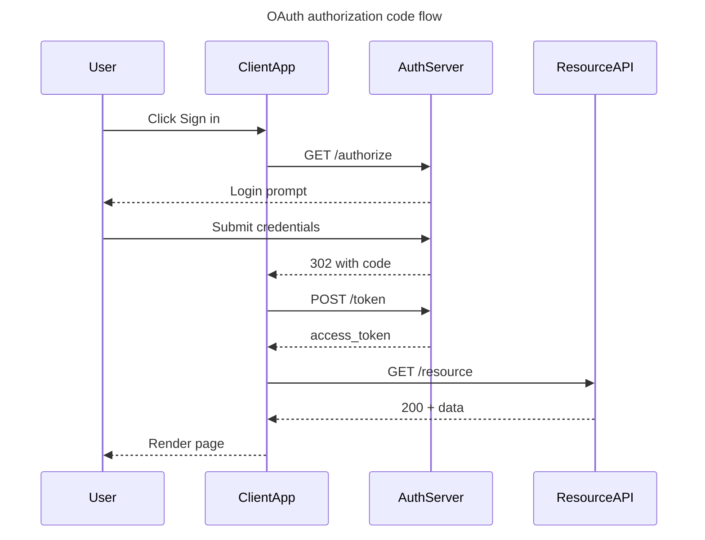

# Sequence Diagrams

Use this reference for **sequence diagrams** — interactions over time between parties (services, users, systems). API request/response flows, auth handshakes, multi-service choreography, RPC call traces, event cascades.

The renderer is a **narrow subset** of full Mermaid sequence — read §5 carefully, because several features people commonly reach for (notes, loops, alt/else, activation boxes, colored blocks, autonumber) are silently dropped by our handler. The good news: most of those can be added back on top of the generated diagram with `use_figma` — see §7 for the hybrid workflow.

## Contents

1. [When to use a sequence diagram](#1-when-to-use-a-sequence-diagram)
2. [Required skeleton](#2-required-skeleton)
3. [Participants](#3-participants)
4. [Messages](#4-messages)
5. [What's NOT supported](#5-whats-not-supported)
6. [Best practices](#6-best-practices)
7. [Hybrid workflow: `generate_diagram` first, then `use_figma` for everything else](#7-hybrid-workflow-generate_diagram-first-then-use_figma-for-everything-else)
8. [Validation checklist](#8-validation-checklist)
9. [Complete example](#9-complete-example)
10. [Calling generate_diagram](#10-calling-generate_diagram)

---

## 1. When to use a sequence diagram

Good fits:

- **API call flows** — client → gateway → service → datastore, showing request and response messages
- **Auth handshakes** — OAuth, SAML, OIDC, session exchanges
- **Event choreography** — producers, brokers, consumers reacting over time
- **Multi-service workflows** — where the order of messages between services is the point
- **Protocol traces** — WebSocket, gRPC streaming, custom RPC

Bad fits (route to a different diagram type):

- Static architecture without time order → architecture flowchart
- Branching workflow with decisions and states → flowchart
- State transitions of a single entity → state diagram
- Data model → ER diagram

## 2. Required skeleton

```
sequenceDiagram
    title Login flow
    participant User
    participant WebApp
    participant API
    participant Database

    User->>WebApp: Open login page
    WebApp->>API: POST /login
    API->>Database: SELECT user
    Database-->>API: User row
    API-->>WebApp: 200 + session
    WebApp-->>User: Redirect home
```

Every chart needs: the `sequenceDiagram` keyword and at least one message. `title` is optional but recommended. Participants are optional too — any unknown ID referenced in a message is implicitly created — but declaring them explicitly lets you control order.

**Important**: whatever ID you use is what renders. Aliases (`as "Display Name"`) are silently dropped by our parser — see §3.

## 3. Participants

### Aliases (`as "Display Name"`) are silently dropped

Our parser ignores the `as` clause. Whatever **ID** you choose is what renders in the diagram — the alias never appears.

```
participant api as "API Service"     // renders as "api"
participant API                      // renders as "API"
participant ClientApp                // renders as "ClientApp"
```

**Consequence**: pick IDs that read well on their own. Use readable PascalCase or camelCase (`ClientApp`, `AuthServer`, `Database`), not cryptic short forms (`a`, `p1`) expecting an alias to decorate them.

Avoid spaces in IDs — they'll break the parse. If the user wants "Auth Server" as a display name, use `AuthServer` or `auth_server` as the ID.

### Explicit declaration

```
participant ClientApp
participant AuthServer
participant Database
```

Participants render in the left-to-right order they're declared.

### Participant types: all render the same

Mermaid supports two keyword forms (`participant`, `actor`) and a JSON-config form for six more types:

```
actor User
participant WebApp
participant DB@{"type": "database"}
participant Q@{"type": "queue"}
// also: "boundary", "control", "entity", "collections"
```

Syntax notes:

- Use `@{"type": "..."}` **immediately after the ID** — no comma, no space.
- `participant id, {"type": "..."}` (the comma form documented in some Mermaid sources) does **not** work here.

**Our renderer draws all of these as the same rectangle.** There's no visual difference between an `actor`, a `database`, a `queue`, or a plain `participant` in the output. The type metadata is parsed and passed through but not rendered distinctly.

Consequence: **don't bother with type annotations** — they're visual noise in the Mermaid source with no payoff. Just use `participant` for everything.

If the user specifically wants visually distinct participant shapes (a cylinder for a database, a horizontal cylinder for a queue, a stick figure for a user), generate the base sequence here and then use `use_figma` to swap in the right shapes on top — see §7.

### Implicit participants

Any ID referenced in a message is auto-created if not declared. Fine for quick diagrams; for anything larger, declare explicitly so you control order. Either way, the ID is the display name.

## 4. Messages

Canonical form:

```
<from>->><to>: <message text>
```

### Arrow types

Our handler maps Mermaid's arrow syntaxes to **8 distinct visual outcomes**:

| Visual                      | Syntaxes that produce it | Use for                                         |
| --------------------------- | ------------------------ | ----------------------------------------------- |
| Solid, triangle head        | `A->>B`, `A-xB`          | **Default** — synchronous forward call, request |
| Solid, thin point           | `A-)B`                   | Async fire-and-forget                           |
| Solid, no head              | `A->B`                   | Rare — usually prefer `->>`                     |
| Dotted, triangle head       | `A-->>B`, `A--xB`        | **Default for return** — response, reply        |
| Dotted, thin point          | `A--)B`                  | Async return / callback                         |
| Dotted, no head             | `A-->B`                  | Rare                                            |
| Solid, triangles both ends  | `A<<->>B`                | Bidirectional sync channel                      |
| Dotted, triangles both ends | `A<<-->>B`               | Bidirectional async channel                     |

Note: `-x` and `->>` render identically (both solid + triangle), and `--x` and `-->>` render identically (both dotted + triangle). The cross visual is not supported for sequence messages. Use the `->>`/`-->>` form for clarity.

**Pattern**: use `->>` for forward calls (request), `-->>` for return messages (response). That alone covers 80% of sequence diagrams and reads clearly.

### Message labels

Put the label after the colon. Labels are plain text — no quoting needed.

- Short, imperative for forward calls: `POST /login`, `validateToken`, `fetch user`
- Short, noun phrase for returns: `200 OK`, `User{id, name}`, `session token`
- Include status codes, endpoint paths, and key identifiers — these are what make a sequence diagram useful.

**Semicolon preprocessing**: semicolons inside a message label are rewritten to periods by our preprocessor (except at end of statement). Write `Items: a, b` rather than `Items; a; b`.

## 5. What's NOT supported

Our renderer is a **substantial** subset of full Mermaid sequence. The following are parsed but **silently dropped by our processor** — the rendered diagram will not contain them:

- **Notes** — `Note over X: text`, `Note left of X`, `Note right of X`. All dropped. (Tool description confirms: "In sequence diagrams, do not use notes.")
- **Activation / deactivation** — `activate X` / `deactivate X`, and the `+`/`-` shorthand on arrows (`A->>+B: call`). The activation rectangles don't render.
- **Loops** — `loop ... end`. The inner messages still render, but the loop wrapper/label is gone.
- **Alternatives** — `alt ... else ... end`. Inner messages render flat, with no branch indication.
- **Optional** — `opt ... end`. Same — contents render, wrapper is gone.
- **Parallel** — `par ... and ... end`. Parallel messages render as a linear sequence.
- **Critical / break** — `critical ... option ... end`, `break ... end`. Dropped.
- **Colored blocks** — `rect rgb(...) ... end`. No background highlighting.
- **Autonumber** — `autonumber`. Messages are not numbered.
- **Links** — `link X: ...`, `links X: ...`. Not supported.
- **Box groupings** — `box ... end` around participants. Not rendered.

**If the user asks for any of these**, don't stretch the Mermaid syntax trying to imitate them — the output will silently omit the feature. The better move in most cases is to generate the core sequence (participants + messages) with this tool, then layer the missing pieces on top with `use_figma`. See §7 for the hybrid workflow.

## 6. Best practices

1. **Pick the two key arrow types** — `->>` for forward, `-->>` for return. Mix a third (like `-)` for async) only when it encodes real semantics.
2. **Declare participants explicitly** for any diagram with 3+ participants. Auto-discovery by first mention is fine for 2, but order control matters past that.
3. **One flow per diagram.** If you have a happy path and an error path, draw two diagrams, not one with `alt/else` (which won't render as a branch anyway).
4. **Label every message.** Unlabeled arrows in a sequence diagram are nearly useless — the label is the whole point.
5. **Keep labels short.** 1–5 words. Include the specifics that matter (endpoint path, status code, return type) and drop the rest.
6. **Cap at ~15 messages.** Past that, split into multiple diagrams (per phase, per outcome, per actor cluster).
7. **Readable participant IDs.** The ID renders directly (aliases are dropped — §3), so choose something that reads well: `API`, `Database`, `AuthServer`, `ClientApp`. Avoid cryptic short forms (`a`, `p1`) and avoid overly long ones (`AuthenticationServiceV2`). 1–2 words in PascalCase is the sweet spot.

## 7. Hybrid workflow: `generate_diagram` first, then `use_figma` for everything else

`generate_diagram` produces a clean baseline — participants arranged in columns, labeled messages in order, consistent layout. That's the hard part. Most of what our renderer _doesn't_ support (notes, colored regions, step numbers, distinct participant shapes, annotations, callouts) is exactly the kind of layered-on content that `use_figma` handles well once a baseline exists.

**Default workflow for any sequence that needs more than raw messages:**

1. **Scaffold with `generate_diagram`** — generate the participants + messages as a clean Mermaid sequence. Skip the features that get dropped (notes, loops, alt/else wrappers, activation bars, rects, autonumber). The output is a FigJam file with a laid-out sequence.
2. **Extend with `use_figma`** — open the same file (via `fileKey`) and add the pieces the Mermaid syntax couldn't express:
   - Sticky notes or text blocks for **annotations** anchored to specific messages
   - Rectangles behind groups of messages for **phase highlighting**
   - Vertical rectangles on a lifeline for **activation bars**
   - Sequence numbers (`1.`, `2.`, …) placed next to messages
   - Replacement shapes for participants — cylinder for database, horizontal cylinder for queue, person icon for actor
   - Labeled groups (e.g. a rectangle around a block of messages labeled "retry loop") to stand in for `loop`/`alt`/`opt`
   - Surrounding narrative, adjacent diagrams, or screenshots on the same board

Loading [figma-use](../../figma-use/SKILL.md) and [figma-use-figjam](../../figma-use-figjam/SKILL.md) covers how to make those edits.

### When to skip `generate_diagram` entirely

Only if the baseline the tool would produce isn't useful. For example:

- The user wants a **non-standard layout** (swimlane-style timeline, a radial sequence, a hand-drawn-style sketch) that doesn't resemble Mermaid's output.
- The user has a **specific reference mock** they want matched closely, and the auto-layout would fight it.
- The sequence is **tiny** (2–3 messages) and it's faster to place shapes manually than to prompt two tools.

In those cases, go straight to `use_figma`.

### Signals the request needs the hybrid workflow (not pure `generate_diagram`)

- The user uses words like "note", "annotate", "callout", "highlight the loop", "show the alt/else branches", "activation box", "color-code the phases", "number the steps".
- The user has already generated a sequence and is asking for refinements (notes, rects, activations) that the renderer can't produce.
- The user wants to combine the sequence with adjacent content (architecture diagram, narrative, screenshots) on the same board.
- The user wants visually distinct participant shapes (database cylinder, queue cylinder, stick-figure actor).

### Be pragmatic, not performative

Don't over-explain the workflow to the user. If the request is specific, just scaffold and extend — call both tools in order. If it's ambiguous, scaffold first and ask something like "I've set up the base sequence — want me to add notes / phase highlighting / activation bars / step numbers?"

## 8. Validation checklist

Before calling `generate_diagram`:

1. `sequenceDiagram` keyword on line 1 (after any leading whitespace).
2. Participant IDs are readable on their own (no cryptic `a`, `p1`). The ID is what renders — aliases are dropped.
3. No `as "Display Name"` aliases (they'll be stripped — §3).
4. No `@{"type": "..."}` annotations on participants — they parse but don't render distinctly (§3). Use plain `participant`.
5. No `Note`, `activate`/`deactivate`, `+`/`-` activation shorthand, `loop`, `alt`, `opt`, `par`, `critical`, `break`, `rect`, `autonumber`, or `link` lines (they'll be dropped — §5).
6. Every message has a label.
7. Labels have no semicolons (they'll be rewritten to periods).
8. Under ~15 messages, or the diagram is split.
9. Arrow types chosen deliberately — `->>` for forward, `-->>` for return, others only when they carry meaning.

## 9. Complete example

An OAuth authorization-code flow — a classic sequence-diagram use case:



## 10. Calling generate_diagram

Pass:

- `name` — a descriptive diagram name
- `mermaidSyntax` — your sequence source
- `userIntent` — what the user is trying to accomplish

Do **not** pass `useArchitectureLayoutCode` — that's architecture-diagram only.
