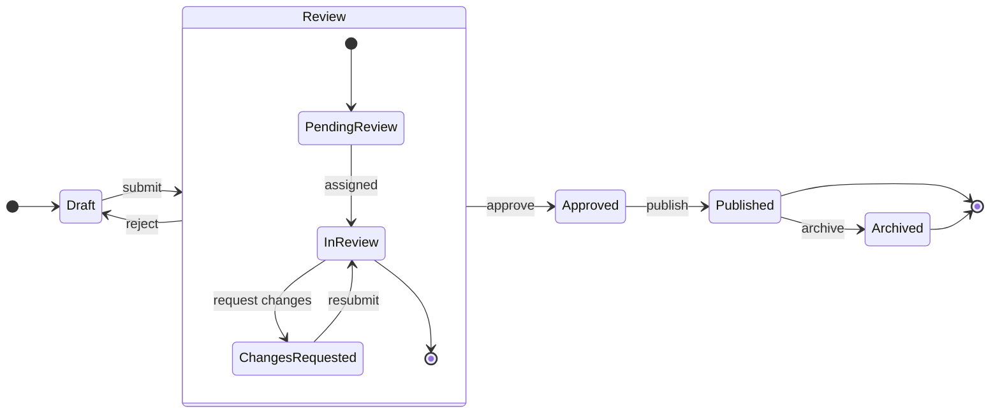

# State Diagrams

Use this reference for **state diagrams** — the states of a single entity or system and the transitions between them. Think: an order moving from Pending → Paid → Shipped → Delivered, a user account through Active / Suspended / Deleted, a TCP connection, a deploy pipeline, a state machine of any kind.

If the subject is **interactions between multiple parties over time**, use a sequence diagram instead. If it's a **decision tree with branches but no real state concept**, use a flowchart.

## Contents

1. [When to use a state diagram](#1-when-to-use-a-state-diagram)
2. [Required skeleton](#2-required-skeleton)
3. [States](#3-states)
4. [Start and end: `[*]`](#4-start-and-end-)
5. [Transitions](#5-transitions)
6. [Composite (nested) states](#6-composite-nested-states)
7. [Special states: choice, fork, join](#7-special-states-choice-fork-join)
8. [What's NOT supported](#8-whats-not-supported)
9. [Layout (same ELK as flowcharts)](#9-layout-same-elk-as-flowcharts)
10. [Hybrid workflow: `generate_diagram` first, then `use_figma`](#10-hybrid-workflow-generate_diagram-first-then-use_figma)
11. [Best practices](#11-best-practices)
12. [Validation checklist](#12-validation-checklist)
13. [Complete example](#13-complete-example)
14. [Calling generate_diagram](#14-calling-generate_diagram)

---

## 1. When to use a state diagram

Good fits:

- **Entity lifecycles** — orders, accounts, subscriptions, tickets, documents
- **State machines** — protocol states (TCP, auth), workflow states, process states
- **Feature flags / rollout states** — experimental / on / off / archived
- **Review / approval flows** — draft / submitted / approved / published
- **Session lifecycles** — idle / active / expired / revoked

Bad fits (route to a different diagram type):

- Interactions between parties over time → sequence diagram
- Decision tree / pipeline without stateful entities → flowchart
- Services + datastores → architecture flowchart
- Timeline with dates → gantt chart
- Data model → ER diagram

## 2. Required skeleton

```
stateDiagram-v2
    direction LR
    [*] --> Draft
    Draft --> Review: submit
    Review --> Approved: approve
    Review --> Draft: reject
    Approved --> Published: publish
    Published --> [*]
```

Every chart needs: the `stateDiagram-v2` keyword on line 1 and at least one transition. `direction` is optional — `LR` (left-to-right) is the usual choice; `TB` (top-to-bottom) suits deeper hierarchies. Prefer `stateDiagram-v2` over the legacy `stateDiagram` for consistency.

## 3. States

Three declaration forms, all supported:

### Simple ID

```
Draft --> Review
```

The state ID is used as both the handle and the display text. Fine for short names that read well (`Draft`, `Active`, `Failed`).

### ID + description (colon syntax)

```
Draft: Draft (editable)
Draft --> Review
```

The ID (`Draft`) is what you reference in transitions; the description (`Draft (editable)`) is what renders. Use this when the display text includes spaces, punctuation, or detail that you don't want in every transition line.

### `state "description" as id`

```
state "Waiting for approval" as Pending
Pending --> Approved
```

Functionally equivalent to the colon form — pick one style per diagram and stick with it.

### Display-name normalization

Our preprocessor strips quotes and normalizes state IDs internally. **The description is always what renders**. For simple-ID states, the ID is the description; for colon or `as` forms, the description you provide is the display name. Don't chase special quoting — just write plain descriptions.

### Spaces in state names

Simple-ID form can't have spaces (`Under Review` would break). Use the colon or `as` form:

```
Pending: Under Review
Pending --> Approved
```

## 4. Start and end: `[*]`

`[*]` is both start and end, distinguished by arrow direction:

```
[*] --> Draft          // start transition
Published --> [*]      // end transition
```

Multiple entries and exits are allowed. You can mix them freely — `[*] --> Draft` and `[*] --> Recovered` both point to start-adjacent states.

Inside a composite state, `[*]` denotes the entry and exit points of that composite. See §6.

## 5. Transitions

```
From --> To
From --> To: label
```

- Use `-->` (double dash, not `->`).
- Add a label with `:` — usually the event or action that triggers the transition (`submit`, `approve`, `timeout`, `retry`).
- Keep labels short (1–3 words). Unlabeled transitions are fine when the target name tells the whole story (`Draft --> Review`).

**Self-transitions** work:

```
Active --> Active: heartbeat
```

**Cycles** are legitimate in state diagrams (a ticket can reopen, an account can be suspended and reactivated). The ELK layout handles cycles reasonably, especially in small-to-medium diagrams — see §9 for layout notes. Don't avoid cycles if they represent the real state machine.

## 6. Composite (nested) states

Group related substates inside a parent state with `{ ... }`:

```
stateDiagram-v2
    [*] --> Active
    Active --> [*]

    state Active {
        [*] --> Idle
        Idle --> Working: task arrives
        Working --> Idle: task done
        Working --> [*]
    }
```

The composite renders as a **subgraph** (box) containing its children. The inner `[*]` markers are scoped to the composite — they represent entry/exit of the `Active` state, not of the whole diagram.

### Nesting

Nested composites work. Keep nesting to **2 levels max** — deeper nesting crowds the ELK layout.

### Concurrent regions inside a composite — the `--` separator

Splitting a composite into concurrent regions with `--` is supported; each region renders as its own nested subgraph inside the parent composite:

```
state Running {
    state "Reads" as ReadPath
    [*] --> ReadPath
    ReadPath --> [*]
    --
    state "Writes" as WritePath
    [*] --> WritePath
    WritePath --> [*]
}
```

Each region has its own `[*]` entry and exit scoped to that region. Use this when two independent sub-flows run simultaneously inside a single outer state.

### Cross-composite transitions — stay simple

Mermaid forbids transitions directly between nested states in *different* composites. Transition to or from the outer composite instead:

```
// WORKS — outer composite to/from
Active --> Suspended
Suspended --> Active

// DOESN'T WORK — reaching into another composite's internals
Active.Working --> Suspended.Held
```

## 7. Special states: choice, fork, join

### Choice — conditional branching

```
state DecideRoute <<choice>>
Received --> DecideRoute
DecideRoute --> Fast: priority=high
DecideRoute --> Normal: priority=low
```

Renders as a diamond. Use for a branch-by-condition that happens at a single point.

### Fork / join — parallel paths

```
state StartParallel <<fork>>
state EndParallel <<join>>

[*] --> StartParallel
StartParallel --> PathA
StartParallel --> PathB
PathA --> EndParallel
PathB --> EndParallel
EndParallel --> [*]
```

Fork splits into parallel paths; join merges them back. Renders as distinct bar shapes. Use sparingly — they're specialized and can confuse readers unfamiliar with UML state-machine notation.

## 8. What's NOT supported

- **Notes** — `note left of X`, `note right of X`, `note above/below`. **Avoid strictly.** These interact badly with our preprocessor: the `X: text` inside a note is recognized as a state definition, producing phantom duplicate states. The resulting diagram is actively wrong, not just missing the note. If the user wants notes, generate the diagram without them and add real sticky notes or text blocks via `use_figma` (§10).
- **Styling** — `classDef`, `class Foo styleName`, `:::styleName` inline, and `style StateId fill:#hex,stroke:#hex`. **Avoid strictly.** These are not applied, AND the state names referenced in these statements get registered as standalone states, creating phantom orphan boxes above or beside the real diagram. The failure mode is the same shape as notes: not just missing, actively wrong. Color-code states via `use_figma` post-generation instead (§10).
- **Transitions reaching into another composite's children** — forbidden by Mermaid itself; transition to/from the outer composite.

If the user wants notes or color-coded states, see §10 for the hybrid workflow.

## 9. Layout (same ELK as flowcharts)

State diagrams render via the **same ELK layered layout** as flowcharts. The layout principles from [flowchart.md §5 (ELK survival guide)](./flowchart.md#5-elk-survival-guide) apply directly:

- **Simple cycles render fine** — retry loops, reopen transitions, reactivation paths. Don't contort the state machine to avoid them.
- **Subgraphs cluster cleanly** — composite states use this automatically.
- **Fan-in gets messy past ~5 inbound edges** — if many states converge to one `Failed` or `Terminated` state, consider splitting or duplicating (but be careful: state semantics usually preclude duplicating a state).
- **Pain scales with size** — 20+ states in one diagram starts to crowd. Split into phases/subsystems or introduce more composite grouping.

Additionally, for state diagrams specifically:
- **Style composites so they stand out.** Like subgraphs in flowcharts, composites show only a thin outline by default and can blend into the canvas. The flowchart guidance on subgraph styling applies (use light tints from the FigJam palette). Note: our preprocessor doesn't extract `classDef`/`class`/`style` statements, so this styling must be applied via the hybrid workflow (§10).
- **Self-transitions render with tight spacing.** A self-loop (`Working --> Working: heartbeat`) will render, but the loop arc and its label can end up crowded against the state. Don't avoid self-transitions — they represent real state-machine behavior — but tell the user that if the spacing looks tight, they can drag the loop or label manually in Figma.

## 10. Hybrid workflow: `generate_diagram` first, then `use_figma`

State diagrams generated via `generate_diagram` produce a clean, laid-out state machine — the hard part. Most of what our renderer doesn't support (notes, colored states, step annotations, phase highlighting) can be added on top with `use_figma`.

**Default workflow when the request needs more than bare states and transitions:**

1. **Scaffold with `generate_diagram`** — states, transitions, composites, concurrent regions (`--`), special states (choice/fork/join), start/end. Skip the features that get dropped (notes, classDef).
2. **Extend with `use_figma`** — open the same file (via `fileKey`) and add:
   - Sticky notes or text blocks for **annotations** anchored to specific states or transitions
   - Background rectangles behind groups of states for **phase highlighting**
   - Tinted fills on composites/subgraphs so boundaries stand out
   - **Color-coding** states by category (terminal / active / error)
   - **Sequence numbers** on transitions for step-by-step walkthroughs

Loading [figma-use](../../figma-use/SKILL.md) and [figma-use-figjam](../../figma-use-figjam/SKILL.md) covers how to make those edits.

### Signals the request needs the hybrid workflow

- The user uses words like "note", "annotate", "highlight", "color the error states", "shade the happy path", "number the transitions".
- The user wants to combine the state diagram with surrounding narrative or another diagram on the same board.

### When to skip `generate_diagram` entirely

Only if the baseline layout isn't useful — e.g. the user wants a non-standard layout (circular state wheel, hand-drawn sketch, a heavily-stylized enterprise template). In those cases, go straight to `use_figma`.

### Be pragmatic, not performative

Scaffold first, extend directly if the user's request is specific; otherwise scaffold and ask one follow-up: "I've set up the base state machine — want me to add notes / color-code the states / highlight the error paths?"

## 11. Best practices

1. **Use `stateDiagram-v2`**, not the legacy `stateDiagram`.
2. **State names are nouns** (`Draft`, `Active`, `Archived`) — not actions. Actions are transition labels.
3. **Transition labels are events or triggers** (`submit`, `approve`, `timeout`) — short, 1–3 words.
4. **Start every diagram with `[*] -->`** — explicit entry is clearer than implicit.
5. **Terminate paths with `--> [*]`** when a state is genuinely terminal. Not every diagram needs an end marker; some state machines are perpetual.
6. **Group with composites** when 3+ substates share a shared lifecycle (e.g. `Active { Idle, Working }` vs. `Suspended`). Don't composite a pair.
7. **Cap at ~15–20 states.** Past that, split by phase or by entity, or push detail into composites.
8. **One state machine per diagram.** If you have a coarse overview and a zoomed-in view of one composite, draw two diagrams, not one with deeply nested internals.

## 12. Validation checklist

Before calling `generate_diagram`:

1. `stateDiagram-v2` on line 1 (not just `stateDiagram`).
2. All transitions use `-->` (double dash).
3. Every `[*]` marker is on one side of a transition — never on its own.
4. State IDs are simple words (no spaces); descriptions via `:` or `as` when longer text is needed.
5. No `note left of`, `note right of`, etc. — they corrupt the diagram by creating phantom states (§8). Add real notes via `use_figma` later.
6. No `classDef`, `class`, `:::`, or `style` styling lines — they don't color anything AND create phantom orphan states (§8). Apply colors via `use_figma` later.
7. No transitions reaching into another composite's children.
8. Composite nesting is ≤ 2 levels.
9. Under ~20 states, or the diagram is split.

## 13. Complete example

A publishing workflow — draft → review → approved/rejected → published, with a composite for the review sub-states:



## 14. Calling generate_diagram

Pass:

- `name` — a descriptive diagram name
- `mermaidSyntax` — your state-diagram source
- `userIntent` (optional) — what the user is trying to accomplish

Do **not** pass `useArchitectureLayoutCode` — that's architecture-diagram only.
