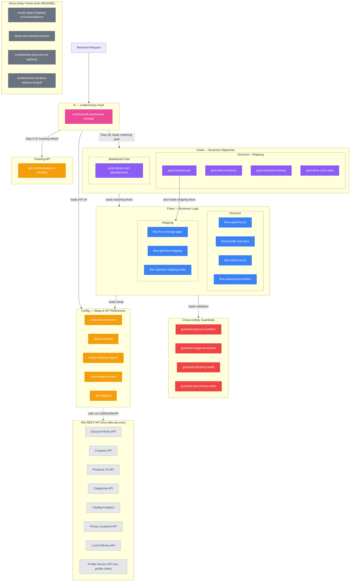

## Skill Graph Diagram

## File Reachability

| File | Reached via |
|---|---|
| `recommend-ecommerce-strategy.md` | README routing (entry point) |
| `api-recommendation-tracking.md` | Entry point tracking steps |
| `goal-increase-aov.md` | Step 4b (UPSELL_BOOST) |
| `goal-clear-inventory.md` | Step 4b (STOCK_MOVER) |
| `goal-seasonal-revenue.md` | Step 4b (SEASONAL) |
| `goal-drive-cross-sells.md` | Step 4b (BUNDLE_AND_SAVE) |
| `goal-reduce-cart-abandonment.md` | Step 4b (ABANDONED_CART domain) |
| `flow-upsell-boost.md` | goal-increase-aov chain |
| `flow-bundle-and-save.md` | goal-increase-aov / goal-drive-cross-sells chain |
| `flow-stock-mover.md` | goal-clear-inventory chain |
| `flow-seasonal-promotion.md` | goal-seasonal-revenue chain |
| `flow-fix-coverage-gaps.md` | goal-reduce-cart-abandonment chain (critical operational fix) |
| `flow-add-free-shipping.md` | goal-increase-aov chain (shipping flows serving AOV) |
| `flow-optimize-shipping-rates.md` | goal-increase-aov chain (shipping flows serving AOV) |
| `guardrail-discount-conflicts.md` | flow-upsell-boost / bundle / stock / seasonal chains |
| `guardrail-margin-protection.md` | flow-upsell-boost / stock-mover chains |
| `guardrail-shipping-health.md` | flow-fix-coverage-gaps chain |
| `guardrail-rate-pricing-sanity.md` | flow-add-free-shipping / optimize chains |
| `setup-discount-rules.md` | All discount flow chains |
| `setup-coupons.md` | Step 4c (COUPON mechanism) |
| `setup-shipping-regions.md` | flow-fix-coverage-gaps chain |
| `setup-shipping-rates.md` | flow-add-free-shipping / optimize chains |
| `api-shipping.md` | Shipping flows (fix-coverage-gaps, add-free-shipping, optimize, recipe, setup-store-pickup) |
| `recipe-apply-shipping-recommendations.md` | README direct entry |
| `setup-store-pickup-location.md` | README direct entry |
| `troubleshoot-discount-not-applying.md` | README direct entry |
| `troubleshoot-checkout-delivery-dropoff.md` | README direct entry |
| `skill-graph.md` | Documentation reference |
